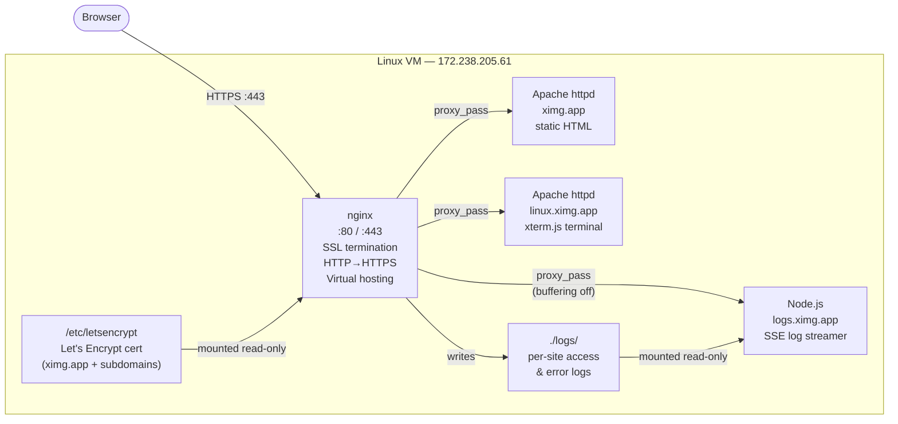

# ximg-web

Production multi-site web stack running on a single Linux VM at `172.238.205.61`. nginx sits in front of all services as a reverse proxy, handles SSL termination via Let's Encrypt, and enforces HTTPS across three subdomains. Apache serves static content on the internal Docker network — all public traffic enters through nginx only.

## Live Sites

| URL | Description |
|-----|-------------|
| [ximg.app](https://ximg.app) | Main landing page |
| [linux.ximg.app](https://linux.ximg.app) | Interactive Linux terminal emulator in the browser |
| [logs.ximg.app](https://logs.ximg.app) | Live nginx log viewer (SSE streaming) |

## Architecture



## Stack

| Component | Image / Runtime | Role |
|-----------|----------------|------|
| nginx | `nginx:alpine` | Reverse proxy, SSL termination, HTTP→HTTPS redirect, virtual hosting |
| Apache (ximg) | `httpd:2.4-alpine` | Serves `ximg.app` static files |
| Apache (linux) | `httpd:2.4-alpine` | Serves `linux.ximg.app` static files including xterm.js terminal |
| Node.js (logs) | `node:22-alpine` | SSE server that tails nginx logs and streams them to the browser |

All containers run on an internal Docker bridge network. Only nginx has public ports (80, 443).

## Subdomains & Virtual Hosting

nginx routes incoming requests by `server_name`:

| Domain | Backend | Notes |
|--------|---------|-------|
| `ximg.app`, `www.ximg.app` | `web:80` | Main site |
| `linux.ximg.app` | `linux:80` | Terminal page |
| `logs.ximg.app` | `logs:3000` | SSE stream — `proxy_buffering off` required |

HTTP requests on port 80 are redirected to HTTPS. ACME challenge paths (`.well-known/acme-challenge/`) are exempt so certbot renewals work without stopping nginx.

## SSL

Certificates are issued and auto-renewed via [Certbot](https://certbot.eff.org/) using the webroot HTTP-01 challenge method.

- Cert covers `ximg.app`, `www.ximg.app`, `linux.ximg.app`, `logs.ximg.app`
- Stored at `/etc/letsencrypt/live/ximg.app/` and mounted read-only into nginx
- Auto-renewed by the certbot systemd timer; a deploy hook reloads nginx on renewal
- TLS 1.2 / 1.3 only, HSTS enforced (`max-age=63072000`)

Manual renewal test:
```bash
certbot renew --dry-run
```

## Logging

nginx writes per-site logs to `./logs/` on the host, mounted read-only into the logs container:

```
logs/
├── ximg.access.log       # ximg.app requests
├── ximg.error.log
├── linux.access.log      # linux.ximg.app requests
├── linux.error.log
├── logs.access.log       # logs.ximg.app requests
├── logs.error.log
├── access.log            # combined (legacy, pre-subdomain split)
└── error.log
```

Generate a markdown summary report:
```bash
bash log-summary.sh
```

## Live Log Viewer (`logs.ximg.app`)

A Node.js server (`logs-server/server.js`) tails the per-site nginx access logs and streams new lines to the browser via [Server-Sent Events](https://developer.mozilla.org/en-US/docs/Web/API/Server-sent_events). On connect it immediately replays the last 100 lines, then streams live updates as they are written.

The frontend features:
- Tab switcher between `ximg.app` and `linux.ximg.app` logs
- Color-coded status codes (green 2xx, cyan 3xx, yellow 4xx, red 5xx)
- Live per-class request counters
- Pause/resume without disconnecting

## Interactive Terminal (`linux.ximg.app`)

Built with [xterm.js](https://xtermjs.org/). A mock shell runs entirely in the browser — no server-side execution. Supported commands: `ls`, `cd`, `cat`, `pwd`, `echo`, `uname`, `whoami`, `hostname`, `date`, `uptime`, `free`, `df`, `ps`, `docker`, `curl`, `env`, `history`, `neofetch`, `clear`, `exit`, `help`. Features arrow-key history, Tab completion, and Ctrl+C/L. A Tux SVG bounces around the background DVD-screensaver style.

## Usage

**Start all services:**
```bash
docker compose up -d
```

**Rebuild after changes:**
```bash
docker compose up -d --build
```

**View live logs on the terminal:**
```bash
tail -f logs/ximg.access.log
```

**Stop:**
```bash
docker compose down
```
