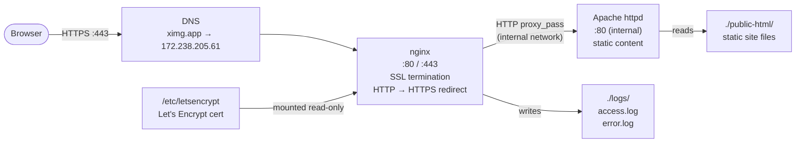

# ximg-web

Production web stack for [ximg.app](https://ximg.app) running on a single Linux VM. nginx sits in front of Apache as a reverse proxy, handles SSL termination via a Let's Encrypt certificate, and enforces HTTPS. Apache serves the static site content internally and is never exposed directly to the internet.

## Architecture



## Stack

| Component | Image | Role |
|-----------|-------|------|
| nginx | `nginx:alpine` | Reverse proxy, SSL termination, HTTP→HTTPS redirect |
| Apache | `httpd:2.4-alpine` | Static file serving (internal only) |

## SSL

Certificates are issued and renewed automatically via [Certbot](https://certbot.eff.org/) with the webroot challenge method.

- Cert lives at `/etc/letsencrypt/live/ximg.app/`
- Mounted read-only into the nginx container
- Auto-renews via the certbot systemd timer; a deploy hook reloads nginx on renewal

To manually renew:
```bash
certbot renew --dry-run
```

## Logs

nginx request and error logs are written to `./logs/` on the host:

```
logs/
├── access.log
└── error.log
```

## Usage

**Start:**
```bash
docker compose up -d
```

**Rebuild after changes:**
```bash
docker compose up -d --build
```

**View logs:**
```bash
tail -f logs/access.log
```

**Stop:**
```bash
docker compose down
```
